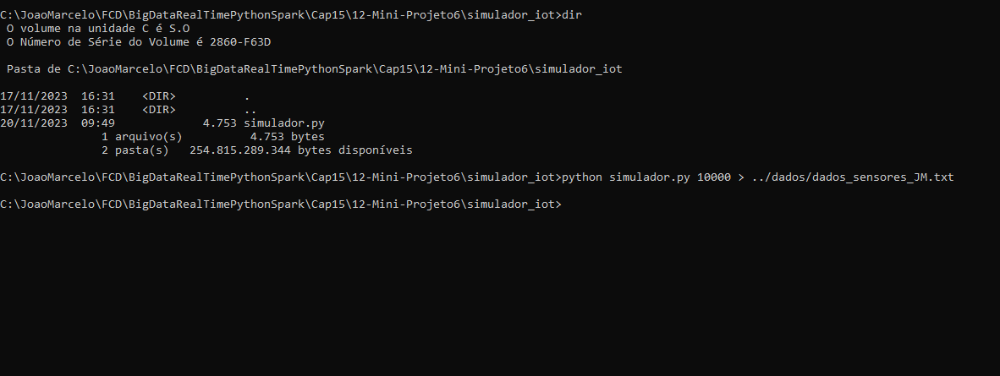
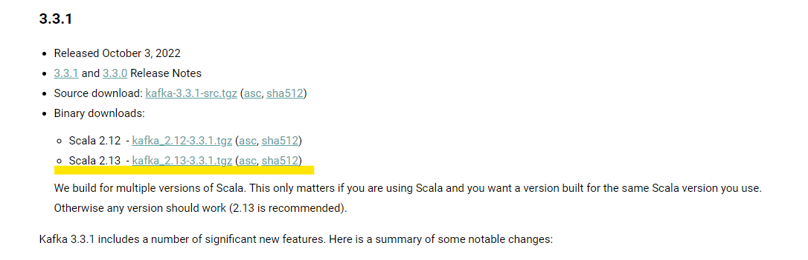
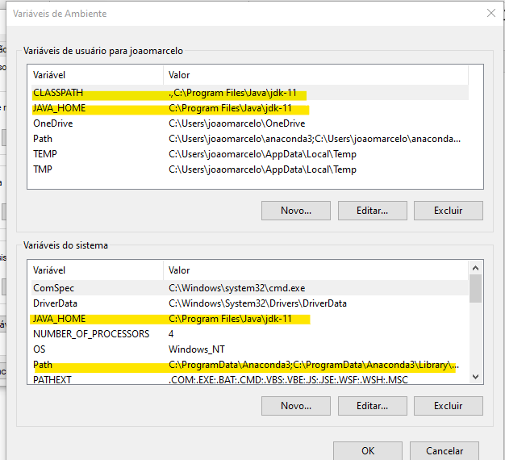
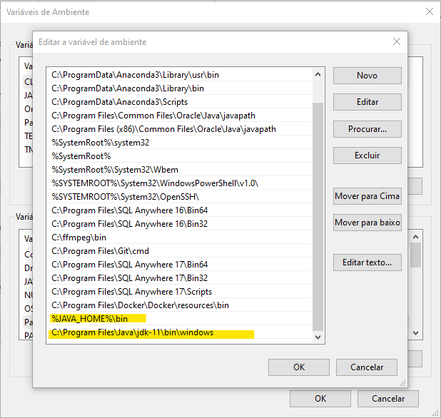
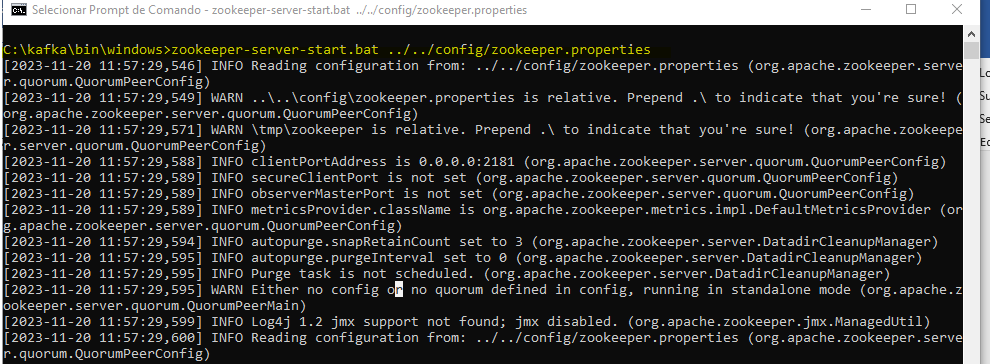
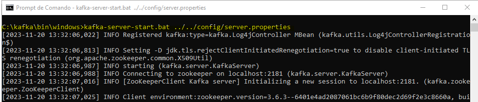
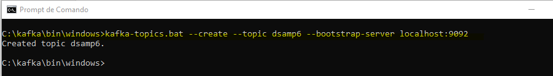
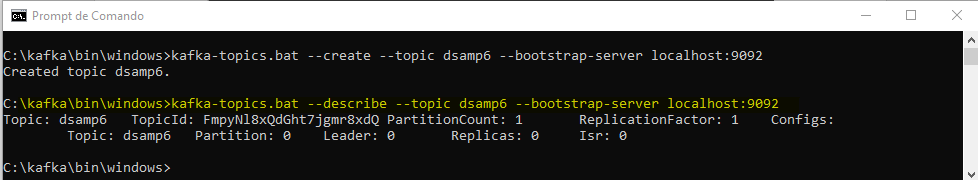
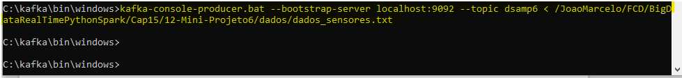
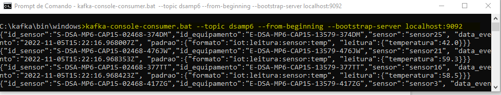

 

# Análise de Dados de Sensores IoT em Tempo Real com Apache Spark Streaming e Apache Kafka

  

  

# Definição do Problema e Fonte de Dados
Neste projeto vamos implementar uma solução completa de análise de dados em tempo real usando o Apache Spark e o Apache Kafka. Vamos coletar dados de sensores IoT (Internet of Things) e, em tempo real (à medida que os dados são gerados e coletados), realizar o trabalho de análise e entregar a resposta para um determinado problema de negócio.

Este projeto é composto de diversas partes uma vez que toda a infraestrutura necessária será construída passo a passo. 

# Simulador IOT

Para coletar dados dos sensores IoT (Internet of Things), vamos seguir as seguintes etapas:

1-	Abrir o terminal ou prompt de comando e acessar a pasta com o simulador.

2-	Execute o comando abaixo para gerar um arquivo com 10.000 leituras de sensores IoT (pode gerar quantos registros você desejar).

> python simulador.py 1000 > ../dados/dados_sensores.txt

  

# Instalação do Apache Kafka

A seguir demonstramos os comandos necessários para instalação e execução do Kafka no Windows:

1-	Acesse a página do Kafka e faça download da versão abaixo:

https://kafka.apache.org/

  

Salvar a pasta do Kafka na mesma pasta do projeto

2-	Configurar variáveis de ambiente, conforme abaixo:

  

  

3-	Abra o prompt de comando, navegue até a pasta do Kafka e execute o comando abaixo para **inicializar o Zookeeper (gerenciador de cluster do Kafka)**
> zookeeper-server-start.bat ../../config/zookeeper.properties

  

4-	Abra outro prompt de comando, navegue até a pasta do Kafka e execute o comando abaixo:
> kafka-server-start.bat ../../config/server.properties

  

5-	Abra outro prompt de comando, navegue até a pasta do Kafka e execute o comando abaixo para **criar um tópico no Kafka:**
> kafka-topics.bat --create --topic dsamp6 --bootstrap-server localhost:9092

  

6-	No mesmo prompt anterior, execute o comando abaixo para **descrever o tópico:**
> kafka-topics.bat --describe --topic dsamp6 --bootstrap-server localhost:9092

  

7-	No mesmo prompt de comando anterior execute o comando abaixo para **produzir o streaming de dados no Kafka (como um produtor de streaming):**
> kafka-console-producer.bat --bootstrap-server localhost:9092 --topic dsamp6 < /JoaoMarcelo/FCD/BigDataRealTimePythonSpark/Cap15/12-Mini-Projeto6/dados/dados_sensores.txt

  

8-	No mesmo prompt de comando anterior execute o comando abaixo para **listar o conteúdo do tópico (como um consumidor de streaming):**
> kafka-console-consumer.bat --topic dsamp6 --from-beginning --bootstrap-server localhost:9092

  

